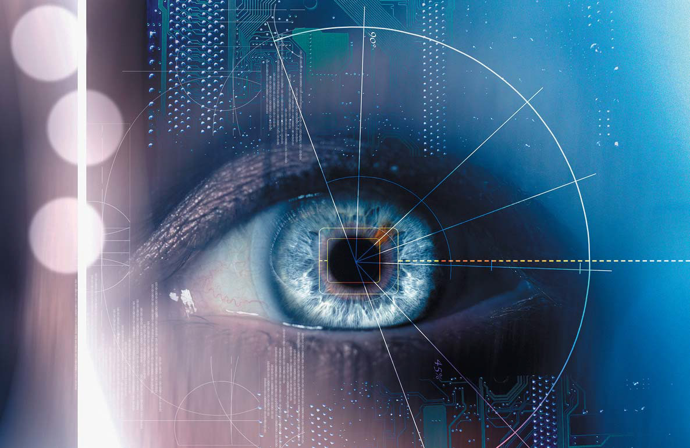

## Компьютерное зрение 

**Литература**

* Шапиро "Компьютерное зрение"
* Форсайт, Понс "Компьютерное зрение: Современный подход"
* Szekiski "Compuer Vision"
* Гонсалес "Цифровая обработка изображений"

Главная задача систем компьютерного зрени - преобразование визуальной информации в форму, удобную для дальнейшей автоматической обреаботки. 

Техническое зрение - зрение, применительно к роботам, станкам, комьютерное зрение шире. 

###Компьютерное зрение: 
 
 * процес извлениения информации об окружении одного или нескольких его изображений и бредставление этой информации в удобном для принятия решений виде.
 * Создание модели реального мира по его изображению 
 * Извлечение описания мира из изображений или видео 

###Различают следующие уровни компьютерного видения:

* Формирование изображений
* **Низкий уровень**
	* Предварительная обработка и анализ изображений и видео (Получение основных примитивов)
* **Средний уровень**
	* Геометрия и движение
* **Высокий Уровень**
	* Вывод семантки
* Приложение   

### Проблемы: 
![] (./img/l1/warning.jpg)
* Огромный объем данных
* Многие задачия вляются обратными 
* Многие задачи некорректны 
	* не имеют решения 
	* имеют безконечно много решений 
* Решаются просто для конкретных условий, сложно резаются для общего случая  	

### Основыне задачи и приложения КВ

* Получение и обработка изображений, видео 
* Востановление 3d формы объектов 
* Распознование объектов
* Оаспознование и сопроваждение движущихся объектов 
* Создание автономных роботов 
* Взаимодействие человека с ПК
* и др.

###Зрение бывает разное

* Магнитное 
* Ультразвуковое 
* и т.д.

